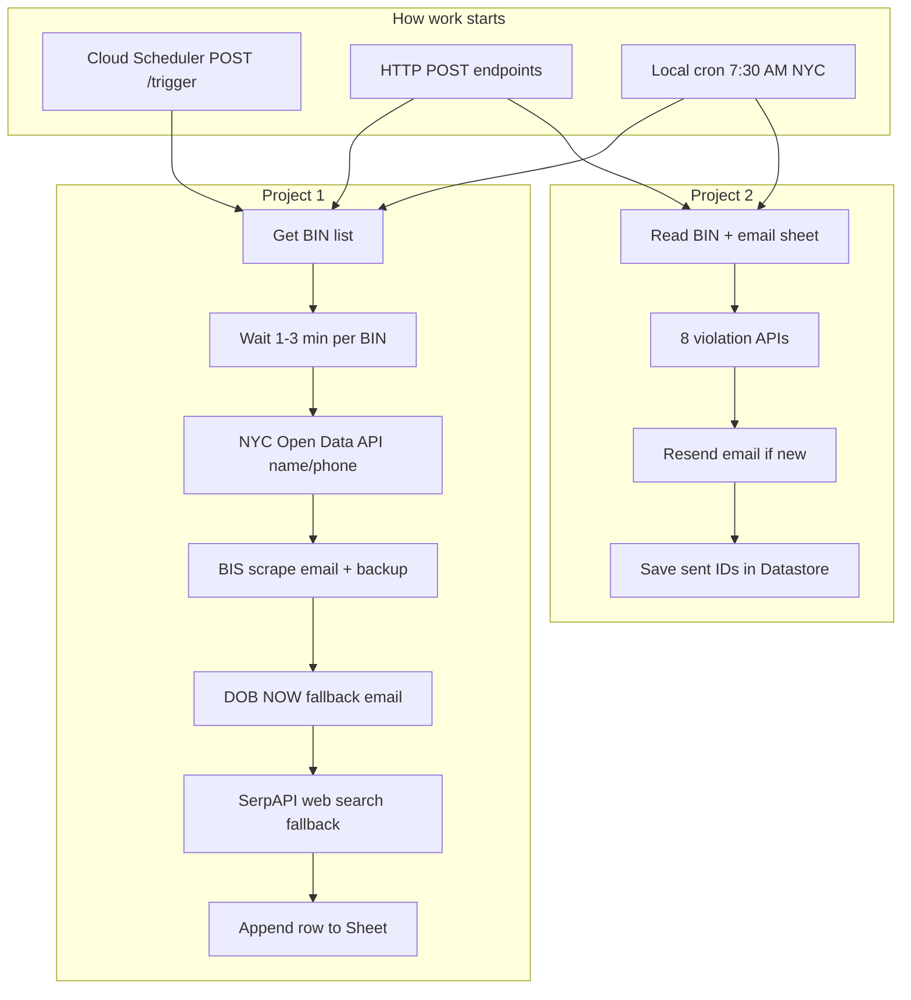

# NYC Properties Bot — Application flow (living doc)

**Last updated:** 2026-05-22  
**Purpose:** Simple step-by-step map of everything the app does. Update this file when behavior changes.

---

## How to keep this doc current

When you change the app, edit the matching section here:

| If you changed… | Update section… |
|-----------------|-----------------|
| New HTTP endpoint | [Step 2 — HTTP API](#step-2--http-api-manual-triggers) |
| Project 1 sheet columns or sources | [Step 5 — Project 1](#step-5--project-1-contact-sheet-one-bin) |
| BIS / DOB NOW scraping | [Step 5.3 BIS](#step-53-bis-scrape) / [Step 5.4 DOB NOW](#step-54-dob-now-fallback) |
| Project 2 emails or datasets | [Step 6 — Project 2](#step-6--project-2-violation-emails) |
| Cron / scheduler | [Step 1 — How the app starts](#step-1--how-the-app-starts) |
| Deploy / env vars | [Step 8 — Production](#step-8--production-cloud-run) |

---

## Big picture (30 seconds)

The bot does **two jobs**:

1. **Project 1** — For each building (BIN), collect **owner contact info** (email, phone, name) and write one row to a **Google Sheet** (tab = today’s date).
2. **Project 2** — For each BIN + email in a **different Google Sheet**, check **NYC Open Data violation APIs**, email the owner about **new** violations only, and remember what was already sent in **Google Datastore**.

Scraping uses **Playwright (Chrome)**. PDF text uses **Google Gemini**. Lists of BINs come from **NYC Open Data** and **Google Datastore** tracks progress.

---

## Step 1 — How the app starts

### A. Production (Google Cloud Run)

| Step | What happens |
|------|----------------|
| 1 | Docker container runs [`start.sh`](../start.sh): starts virtual display (Xvfb) + **HTTP server only** (`src/http-server.ts`). |
| 2 | Server listens on `PORT` (default **8080**). |
| 3 | **Cloud Scheduler** fires daily at **7:30 AM America/New_York**: `POST https://…/trigger`. |
| 4 | That runs **Project 1 only** (not Project 2). |

Outbound traffic uses **VPC + Cloud NAT** static IPs (see [`EGRESS-STRATEGY.md`](../EGRESS-STRATEGY.md)). Optional `HTTP_PROXY` / `HTTPS_PROXY` for residential proxy.

### B. Local development (`npm start`)

| Step | What happens |
|------|----------------|
| 1 | Runs [`src/index.ts`](../src/index.ts). |
| 2 | If `RUN_NOW=true` in `.env`, runs full daily job **immediately once**. |
| 3 | Schedules **cron** at **7:30 AM NYC** → runs **Project 1 then Project 2**. |
| 4 | Also starts the same **HTTP server** as production. |

### C. Local HTTP-only (good for testing one BIN)

| Step | What happens |
|------|----------------|
| 1 | Run `npx ts-node src/http-server.ts` (no cron). |
| 2 | Call `POST /process-bins` with a BIN list. |

---

## Step 2 — HTTP API (manual triggers)

All routes accept **POST only**. JSON body where noted.

| Endpoint | Body example | What it runs |
|----------|--------------|--------------|
| `/trigger` | `{}` | **Project 1** for *new* BINs (same as scheduler): last 200 BINs from Open Data → filter vs Datastore cursor → process each. |
| `/trigger` | `{ "dates": ["2026-05-20"] }` | **Project 1** backfill: BINs from violations on those dates. |
| `/process-bins` | `{ "bins": ["1060120"], "sheetDate": "2026-05-20" }` | **Project 1** only for listed BINs. `sheetDate` optional (defaults to today NYC). |
| `/process-bins-by-dates` | `{ "dates": ["2026-05-20"] }` | **Project 1** for all BINs found on those dates. |
| `/run-project2` | `{}` | **Project 2** only (violation emails). |

**Note:** `/trigger` does **not** run Project 2. Use `/run-project2` or local `npm start` cron for that.

---

## Step 3 — Where BINs come from (Project 1 queue)

| Source | Used when | How |
|--------|-----------|-----|
| **DOB ECB Violations** Open Data | `/trigger`, daily cron | Latest **200** BINs from `6bgk-3dad.json`, ordered by issue date. |
| **filterNewBins** | After list above | Skips BINs already processed: compares to **last processed BIN** in Datastore. |
| **getBinsForDates** | Backfill endpoints | BINs with violations on specific calendar dates. |
| **Manual list** | `/process-bins` | You pass `bins` array directly. |

**Datastore** ([`bin-tracker.service.ts`](../src/bin-tracker.service.ts)): stores one cursor `last_processed_bin` so the daily run does not re-scrape the whole list from scratch.

---

## Step 4 — Project 1 setup (once per run)

| Step | What happens |
|------|----------------|
| 1 | Log `Starting Project 1 workflow…` |
| 2 | Pick sheet tab name = **today’s date** in NYC (`MM/DD/YYYY`), or `sheetDate` if provided. |
| 3 | Open Google Spreadsheet `PROJECT1_GOOGLE_SHEET_ID`. |
| 4 | If tab does not exist → create tab + header row (7 columns — see [Sheet columns](#sheet-columns-project-1)). |
| 5 | **Launch Chrome** once for the whole run (`initializeBrowser`). |
| 6 | Loop **each BIN** in order (steps below). |
| 7 | **Close browser** when all BINs done (`cleanup`). |

---

## Step 5 — Project 1: contact sheet (one BIN)

For **each BIN**, in order:

### Step 5.1 — Rate limit wait

| Step | What happens |
|------|----------------|
| 1 | Random wait **60–180 seconds** (reduce blocking by NYC sites). |

### Step 5.2 — NYC Open Data API (no browser)

| Step | What happens |
|------|----------------|
| 1 | Query **DOB Job Application Filings** dataset (`ic3t-wcy2`) for `bin__ = BIN`. |
| 2 | Up to **10** rows, newest `latest_action_date` first. |
| 3 | **Name:** owner first/last or business name; if missing → applicant first+last from any row. |
| 4 | **Phone (owner):** first non-empty `owner_sphone__` across those rows. |
| 5 | **No email** from this API (dataset has no owner email field). |
| 6 | Also returns **address**, **borough**, **applicant title/license**, **job description** for web search queries. |
| 7 | **No applicant phone** in API (applicant phone comes from BIS only). |

Code: [`getOwnerContactFromJobApplications`](../src/nyc-open-data.service.ts)

### Step 5.3 — BIS scrape

Goal: mainly **email**; also backup **name / owner phone / applicant phone** from HTML and PDFs.

| Step | What happens |
|------|----------------|
| 1 | Open BIS job list: `JobsQueryByLocationServlet?allbin=BIN`. |
| 2 | Read table → list of **(job number, doc number)** pairs (one row per pair). |
| 3 | If **zero rows** → note `BIS_NO_JOBS`, skip to sheet merge. |
| 4 | For **each** (job, doc) pair (may stop early if email + phone + name all found): |

**Per (job, doc):**

| Sub-step | What happens |
|----------|----------------|
| 4a | Open **Application Details** HTML (`JobsQueryByNumberServlet`) — parse **owner** §26 and **applicant** §2 separately (`Business Phone`, `E-Mail`, `Name`). |
| 4b | Open **Virtual Job Folder** (`BScanVirtualJobFolderServlet`). Record **last attempted URL** (folder URL). |
| 4c | Find table row named exactly **`PLAN / WORK APPROVAL APPLICATION`**. |
| 4d | If no PLAN row → note `BIS_NO_PW1_FORM`, keep any HTML contact, continue. |
| 4e | If PLAN found → open document page (`BScanJobDocumentServlet` + scan code). **Last attempted URL** = document URL. |
| 4f | Download PDF via iframe / request (cookies + referer). |
| 4g | If PDF blocked (403 Akamai) → note `BIS_PDF_DOWNLOAD_FAILED` + `ACCESS_POSSIBLE_BLOCK`, keep HTML contact if any. |
| 4h | If PDF OK → **Gemini** extracts owner fields from PW1 PDF. |
| 4i | If Gemini empty → note `GEMINI_PARSE_OR_EMPTY`. |
| 4j | Merge contact from this job into **best contact** across all jobs; keep latest **applicant phone**. |

Code: [`getBisContactInfo`](../src/dob-scrapper.service.ts), [`processVirtualJobFolder`](../src/dob-scrapper.service.ts)

### Step 5.4 — DOB NOW (fallback)

Runs **only if BIS did not return an email**.

| Step | What happens |
|------|----------------|
| 1 | Open `https://a810-dobnow.nyc.gov/publish/Index.html`. |
| 2 | Click **Search by BIN**, enter BIN, Search. |
| 3 | Click **BUILD: Job Filings**, wait for grid rows. |
| 4 | Sort by **Modified Date** (newest first). |
| 5 | For each grid row (skip rows with empty 6th column): |
| 5a | Open row → **Documents** → look for **asbestos** PDF. |
| 5b | Download PDF → **Gemini** `extractAsbestosInfoFromPdf` for contact. |
| 6 | Stop at first row with usable contact, or note `DOBNOW_NO_ASBESTOS_PDF` / `DOBNOW_ERROR`. |

Code: [`scrapeDobNow`](../src/dob-scrapper.service.ts)

### Step 5.4b — Web search (fallback)

Runs **only if BIS and DOB NOW did not return an email** and `SERP_API_KEY` is set.

| Step | What happens |
|------|----------------|
| 1 | Search owner name first (from API), then applicant name if different. |
| 2 | SerpAPI queries like `"Name" email`, `"Name" contact New York`, borough/address/title variants, `filetype:pdf`. |
| 3 | Regex-extract first valid email from organic result titles/snippets/links. |
| 4 | Notes: `WEB_SEARCH_HIT`, `WEB_SEARCH_NO_EMAIL`, `WEB_SEARCH_SKIPPED_NO_KEY`, etc. |

Code: [`google-search.service.ts`](../src/google-search.service.ts), [`email-extractor.service.ts`](../src/email-extractor.service.ts)

### Step 5.5 — Build sheet row

| Column | How it is filled |
|--------|------------------|
| **BIN** | Current BIN |
| **Email** | BIS → DOB NOW → SerpAPI web search (owner, then applicant) → else `Email not found` |
| **Phone** | Open Data owner phone → BIS owner phone / PDF → else `Phone not found` |
| **Name** | Open Data name → BIS name → else `Name not found` |
| **Applicant Phone** | BIS applicant `Business Phone` only → else `Applicant phone not found` |
| **Denied URL** | Last BIS folder or document URL tried (any outcome) |
| **Reason** | Semicolon-separated diagnostic codes (if any) |

| Step | What happens |
|------|----------------|
| 1 | Append one row to today’s tab via Google Sheets API. |
| 2 | Log result to Cloud Run / console. |

Code: [`runProject1`](../src/app.service.ts)

**Sheet columns (Project 1)** — full detail also in [findings/dobnow-modified-date-manual-debug.md](./dobnow-modified-date-manual-debug.md#sheet-column-semantics).

---

## Step 6 — Project 2: violation emails

Runs when: local cron after Project 1, or `POST /run-project2`.

| Step | What happens |
|------|----------------|
| 1 | Read **Project 2** Google Sheet (`PROJECT2_GOOGLE_SHEET_ID`, tab `PROJECT2_GOOGLE_SHEET_NAME`). |
| 2 | Each data row must have **email** + **bin** columns. |
| 3 | For each (email, BIN) pair: |

**Per (email, BIN):**

| Sub-step | What happens |
|----------|----------------|
| 3a | Fetch violations from **8 NYC Open Data APIs** (ECB, DOB, complaints, safety, HPD, litigation, vacate orders, rodent, etc.). |
| 3b | For each violation type, load **already sent** IDs from Datastore (`SentViolation` entities keyed by email + BIN + type + id). |
| 3c | Keep only **new** violations not sent before. |
| 3d | If any new → build HTML + plain-text email → send via **Resend**. |
| 3e | Save new violation IDs to Datastore so they are not emailed again. |
| 3f | If none new → log skip (no email). |

Code: [`runProject2`](../src/app.service.ts)

---

## Step 7 — Main code files (map)

| File | Role |
|------|------|
| [`src/index.ts`](../src/index.ts) | Local entry: cron + optional `RUN_NOW` + loads HTTP server |
| [`src/http-server.ts`](../src/http-server.ts) | Production entry: POST routes |
| [`src/app.service.ts`](../src/app.service.ts) | Project 1 + Project 2 orchestration |
| [`src/dob-scrapper.service.ts`](../src/dob-scrapper.service.ts) | BIS + DOB NOW Playwright scraping |
| [`src/nyc-open-data.service.ts`](../src/nyc-open-data.service.ts) | NYC Open Data HTTP client |
| [`src/gemini.service.ts`](../src/gemini.service.ts) | PDF → contact (Gemini) |
| [`src/google-sheet.service.ts`](../src/google-sheet.service.ts) | Read/write Google Sheets |
| [`src/bin-tracker.service.ts`](../src/bin-tracker.service.ts) | Last processed BIN in Datastore |
| [`src/resend-mail.service.ts`](../src/resend-mail.service.ts) | Send emails (Project 2) |
| [`src/contact-extraction.types.ts`](../src/contact-extraction.types.ts) | Diagnostic codes + `Reason` column text |

---

## Step 8 — Production (Cloud Run)

| Item | Detail |
|------|--------|
| **Image** | Node 20 + Chrome + Playwright + Xvfb |
| **Memory / timeout** | 4 GiB, up to 3600 s |
| **Egress** | VPC connector + NAT pool (see `EGRESS-STRATEGY.md`) |
| **Secrets / config** | `.env.yaml` at deploy (not in git) |
| **CI deploy** | [`.github/workflows/deploy-cloud-run.yml`](../.github/workflows/deploy-cloud-run.yml) |
| **Daily job** | Scheduler → `POST /trigger` → Project 1 |

---

## Step 9 — Environment variables (required)

| Variable | Used for |
|----------|----------|
| `SOCRATA_APP_TOKEN` | NYC Open Data API |
| `GOOGLE_AI_API_KEY` | Gemini PDF parsing |
| `GOOGLE_SHEET_CREDENTIALS_PATH` | Sheets read/write |
| `GOOGLE_DATASTORE_CREDENTIALS_PATH` | BIN cursor + sent violations |
| `PROJECT1_GOOGLE_SHEET_ID` | Contact results sheet |
| `PROJECT2_GOOGLE_SHEET_ID` | Owner email + BIN list for alerts |
| `PROJECT2_GOOGLE_SHEET_NAME` | Tab name for Project 2 |
| `RESEND_API_KEY` | Project 2 emails |
| `FROM_EMAIL` | Sender address |
| `PORT` | HTTP server port |
| `HTTP_PROXY` / `HTTPS_PROXY` | Optional egress proxy |
| `RUN_NOW` | Local: run daily job on startup |
| `CHROME_PATH` | Optional Chrome binary path |

See [`.env.example`](../.env.example).

---

## Step 10 — Retries and failures

| Behavior | Where |
|----------|--------|
| BIS/DOB NOW navigation retries **3×**, **60 s** apart | `retryOperation` in scraper |
| Screenshots + HTML preview on errors | `/tmp/bis-*`, `/tmp/dobnow-*` logs |
| **Reason** column lists codes like `BIS_PDF_DOWNLOAD_FAILED`, `DOBNOW_UI_TIMEOUT`, `ACCESS_POSSIBLE_BLOCK` | `formatReasonFromNotes` |
| Akamai 403 on PDF / site | Often datacenter/VPN IP — needs residential egress |

---

## Related docs

- [dobnow-modified-date-manual-debug.md](./dobnow-modified-date-manual-debug.md) — BIN `1060120` debug + sheet semantics
- [potential fixes.md](../potential%20fixes.md) — reason-code ideas
- [DEPLOY.md](../DEPLOY.md) — deploy commands
- [EGRESS-STRATEGY.md](../EGRESS-STRATEGY.md) — NAT / proxy

---

## Changelog

| Date | Change |
|------|--------|
| 2026-05-22 | Initial living doc: full flow, HTTP routes, P1/P2, sheet columns, Cloud Run vs local |
