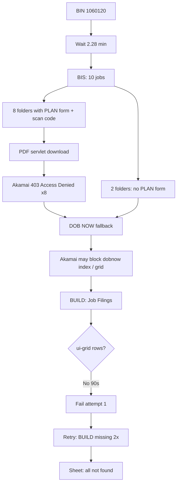

# Single-BIN end-to-end debug — BIN `1060120`

**Run date:** 2026-05-19 (UTC)  
**Source:** Cloud Run logs (`gcloud beta run services logs tail` / Logging API) — post-deploy revision with ui-grid sort + session-aware PDF fixes  
**Session:** Continues after BIN `3155511` in the same `11:02` manual trigger  
**Final sheet row:** `[1060120, Email not found, Phone not found, Name not found]`

This document is a **full pipeline walkthrough for one BIN**: throttle → BIS (all jobs) → DOB NOW → sheet. Use BIN `1060120` for manual reproduction.

**Manual validation (2026-05-20):** Reproduced Akamai blocks from a **US datacenter VPS** and from a **home PC in Pakistan using a paid US VPN**. See [Manual egress validation](#manual-egress-validation-2026-05-20).

---

## Executive summary

| Phase | Duration (approx) | Result | Blocking issue |
|-------|-------------------|--------|----------------|
| Rate-limit wait | ~2.3 min | OK | Random delay before scrape |
| BIS job list | ~1 s | OK | **10 rows** (job + doc pairs) |
| BIS virtual folders + PDFs | ~8.5 min | No contact | Every PDF download → **403 Akamai “Access Denied”** (~59s each) |
| DOB NOW fallback | ~4.7 min | Failed | Grid rows never loaded (90s); retries lost **BUILD: Job Filings** |
| Sheet | — | Not found | All fields empty |

**Root cause (Cloud Run + manual):** **Akamai WAF blocks non-residential egress** on document/PDF endpoints and often on whole DOB properties. US geography alone is insufficient (datacenter VPS, GCP NAT, commercial VPN pools behave similarly).

**Fallback did run** after BIS (`Scraping DOB NOW for BIN: 1060120` in logs) but could not recover contact because DOB NOW never loaded a usable UI from the same class of blocked IPs.

**Modified Date was never reached** for this BIN. Logged `DOBNOW_UI_TIMEOUT` is likely a **symptom of Akamai block or empty error page**, not a missing sort button.

**Suggested reason codes:** `ACCESS_POSSIBLE_BLOCK` (primary) → `BIS_PDF_DOWNLOAD_FAILED` → `DOBNOW_UI_TIMEOUT` (may be `DOBNOW_ACCESS_DENIED` when index is blocked).

---

## Raw log reference (complete sequence)

Log lines below are the operational messages for BIN `1060120` only (HTML preview chunks omitted).

```
2026-05-19 11:08:47 Processing BIN 1060120
2026-05-19 11:08:47 Waiting for 2.2819833333333333 minutes...

2026-05-19 11:11:04 Getting BIS contact info for BIN: 1060120
2026-05-19 11:11:04 Navigating to BIS for BIN: 1060120
2026-05-19 11:11:05 Navigation successful
2026-05-19 11:11:05 Found 10 jobs for BIN 1060120

2026-05-19 11:11:05 Processing Virtual Job Folder for Job: 140047642, Doc: 03
2026-05-19 11:11:06 Found scan code: ESHS0489797
2026-05-19 11:11:08 Downloading PDF from ...passjobnumber=140047642&scancode=ESHS0489797
2026-05-19 11:12:07 Failed to download PDF. Status: 403, Content-Type: text/html, Preview: <HTML>...Access Denied...
2026-05-19 11:12:08 Saved screenshot: /tmp/bis-pdf-403-1779189127857.png
2026-05-19 11:12:08 No PDF content found

2026-05-19 11:12:08 Processing Virtual Job Folder for Job: 123130343, Doc: 01
2026-05-19 11:12:10 Found scan code: SC170425016
2026-05-19 11:12:12 Downloading PDF from ...passjobnumber=123130343&scancode=SC170425016
2026-05-19 11:13:11 Failed to download PDF. Status: 403 ... Access Denied
2026-05-19 11:13:11 Saved screenshot: /tmp/bis-pdf-403-1779189191379.png
2026-05-19 11:13:11 No PDF content found

2026-05-19 11:13:11 Processing Virtual Job Folder for Job: 140400885, Doc: 01
2026-05-19 11:13:13 Found scan code: ES575825469
2026-05-19 11:13:15 Downloading PDF from ...passjobnumber=140400885&scancode=ES575825469
2026-05-19 11:14:14 Failed to download PDF. Status: 403 ... Access Denied
2026-05-19 11:14:15 Saved screenshot: /tmp/bis-pdf-403-1779189254683.png
2026-05-19 11:14:15 No PDF content found

2026-05-19 11:14:15 Processing Virtual Job Folder for Job: 140399316, Doc: 01
2026-05-19 11:14:16 No PLAN / WORK APPROVAL APPLICATION form found

2026-05-19 11:14:16 Processing Virtual Job Folder for Job: 140047642, Doc: 02
2026-05-19 11:14:18 Found scan code: ESHS0489797
2026-05-19 11:14:20 Downloading PDF from ...passjobnumber=140047642&scancode=ESHS0489797
2026-05-19 11:15:19 Failed to download PDF. Status: 403 ... Access Denied
2026-05-19 11:15:20 Saved screenshot: /tmp/bis-pdf-403-1779189319758.png
2026-05-19 11:15:20 No PDF content found

2026-05-19 11:15:20 Processing Virtual Job Folder for Job: 140047642, Doc: 01
2026-05-19 11:15:21 Found scan code: ESHS0489797
2026-05-19 11:15:21 Downloading PDF from ...passjobnumber=140047642&scancode=ESHS0489797
2026-05-19 11:16:23 Failed to download PDF. Status: 403 ... Access Denied
2026-05-19 11:16:23 Saved screenshot: /tmp/bis-pdf-403-1779189383448.png
2026-05-19 11:16:23 No PDF content found

2026-05-19 11:16:23 Processing Virtual Job Folder for Job: 121371942, Doc: 01
2026-05-19 11:16:25 Found scan code: SC120622001
2026-05-19 11:16:25 Downloading PDF from ...passjobnumber=121371942&scancode=SC120622001
2026-05-19 11:17:26 Failed to download PDF. Status: 403 ... Access Denied
2026-05-19 11:17:27 Saved screenshot: /tmp/bis-pdf-403-1779189446834.png
2026-05-19 11:17:27 No PDF content found

2026-05-19 11:17:27 Processing Virtual Job Folder for Job: 120220251, Doc: 01
2026-05-19 11:17:28 Found scan code: SC090731002
2026-05-19 11:17:28 Downloading PDF from ...passjobnumber=120220251&scancode=SC090731002
2026-05-19 11:18:30 Failed to download PDF. Status: 403 ... Access Denied
2026-05-19 11:18:30 Saved screenshot: /tmp/bis-pdf-403-1779189510245.png
2026-05-19 11:18:30 No PDF content found

2026-05-19 11:18:30 Processing Virtual Job Folder for Job: 120027595, Doc: 01
2026-05-19 11:18:32 Found scan code: SC090319034
2026-05-19 11:18:32 Downloading PDF from ...passjobnumber=120027595&scancode=SC090319034
2026-05-19 11:19:33 Failed to download PDF. Status: 403 ... Access Denied
2026-05-19 11:19:34 Saved screenshot: /tmp/bis-pdf-403-1779189573632.png
2026-05-19 11:19:34 No PDF content found

2026-05-19 11:19:34 Processing Virtual Job Folder for Job: 102427072, Doc: 01
2026-05-19 11:19:35 No PLAN / WORK APPROVAL APPLICATION form found
2026-05-19 11:19:35 No contact information found in any job for BIN 1060120

2026-05-19 11:19:35 Scraping DOB NOW for BIN: 1060120
2026-05-19 11:19:35 Navigating to search page
2026-05-19 11:19:39 Searching for BIN
2026-05-19 11:19:45 Navigating to Build Job Filings
2026-05-19 11:21:17 Operation failed on attempt 1/3: page.waitForSelector: Timeout 90000ms exceeded.
2026-05-19 11:21:17   - waiting for locator('.ui-grid-canvas .ui-grid-row') to be visible
2026-05-19 11:21:17 Waiting 1 minutes before retrying...
2026-05-19 11:22:47 Operation failed on attempt 2/3: locator.click: Timeout 30000ms exceeded.
2026-05-19 11:22:47   - waiting for getByRole('button', { name: 'BUILD: Job Filings' })
2026-05-19 11:22:47 Waiting 1 minutes before retrying...
2026-05-19 11:24:17 Operation failed on attempt 3/3: locator.click: Timeout 30000ms exceeded.
2026-05-19 11:24:17   - waiting for getByRole('button', { name: 'BUILD: Job Filings' })
2026-05-19 11:24:17 Error scraping DOB NOW: Failed to complete operation after all retries
2026-05-19 11:24:17 Appended row for BIN 1060120: [1060120, Email not found, Phone not found, Name not found]
```

**Total wall time for this BIN:** ~15 min 30 s (11:08:47 → 11:24:17).

---

## Timeline table

| Time (UTC) | Δ | Event | Phase |
|------------|---|-------|-------|
| 11:08:47 | — | `Processing BIN 1060120` | Start |
| 11:08:47 | 0 | Wait **2.28 min** | Throttle |
| 11:11:04 | +2m17s | BIS navigate | BIS |
| 11:11:05 | +1s | **10 jobs** found | BIS |
| 11:11:05–11:19:34 | +8m29s | 10 virtual folders (see job table) | BIS |
| 11:19:35 | +1s | DOB NOW fallback starts | DOB NOW |
| 11:19:45 | +10s | Click BUILD: Job Filings | DOB NOW |
| 11:21:17 | +92s | Grid rows timeout (90s) | DOB NOW fail #1 |
| 11:22:47 | +90s | BUILD button timeout (retry 2) | DOB NOW fail #2 |
| 11:24:17 | +90s | BUILD button timeout (retry 3) | DOB NOW fail #3 |
| 11:24:17 | 0 | Sheet row appended | Done |

---

## Pipeline flow



---

## BIS data model (for debugging)

| Term | Meaning | Example `1060120` |
|------|---------|-------------------|
| **BIN** | Building ID (one premises) | `1060120` — 106 W 143 St |
| **Job** | One permit/filing (not a violation count) | `140047642` |
| **Doc** | Document package under that job (`01`–`03`) | Doc `03` = PAA on doc `01` |
| **10 jobs** in logs | **10 table rows** = 10 `(job, doc)` pairs | Job `140047642` appears **3×** (docs 01, 02, 03) |

**Pages the bot uses vs manual clicks:**

| Page | URL pattern | Bot uses? |
|------|-------------|-----------|
| Job list by BIN | `JobsQueryByLocationServlet?allbin=` | Yes — reads table, does not click each job |
| Application Details | `JobsQueryByNumberServlet?passjobnumber=` | **No** — applicant email may appear here but bot skips it |
| Virtual Job Folder | `BScanVirtualJobFolderServlet?passjobnumber=&passdocnumber=&allbin=` | Yes — looks for `PLAN / WORK APPROVAL APPLICATION` |
| Document / PDF | `BScanJobDocumentServlet?...&scancode=` | Yes — iframe PDF fetch (Akamai 403) |

**Bot loop:** For each of 10 rows → open Virtual Job Folder URL directly → find PLAN scan → download PDF → Gemini extract → stop on first success. For this BIN, all PDF attempts failed; then `scrapeDobNow(bin)` runs (`app.service.ts`).

---

## Phase 1 — Rate limit

```
Waiting for 2.2819833333333333 minutes...
```

- Random **60–180 s** before each BIN (`app.service.ts`).

---

## Phase 2 — BIS (complete job table)

**Listing URL:**  
`https://a810-bisweb.nyc.gov/bisweb/JobsQueryByLocationServlet?requestid=1&allbin=1060120`

| # | Job | Doc | Scan code | PLAN form? | PDF outcome | Screenshot |
|---|-----|-----|-----------|------------|-------------|------------|
| 1 | 140047642 | 03 | ESHS0489797 | Yes | 403 Access Denied (~59s) | `bis-pdf-403-1779189127857.png` |
| 2 | 123130343 | 01 | SC170425016 | Yes | 403 Access Denied | `bis-pdf-403-1779189191379.png` |
| 3 | 140400885 | 01 | ES575825469 | Yes | 403 Access Denied | `bis-pdf-403-1779189254683.png` |
| 4 | 140399316 | 01 | — | **No** | Skipped | — |
| 5 | 140047642 | 02 | ESHS0489797 | Yes | 403 Access Denied | `bis-pdf-403-1779189319758.png` |
| 6 | 140047642 | 01 | ESHS0489797 | Yes | 403 Access Denied | `bis-pdf-403-1779189383448.png` |
| 7 | 121371942 | 01 | SC120622001 | Yes | 403 Access Denied | `bis-pdf-403-1779189446834.png` |
| 8 | 120220251 | 01 | SC090731002 | Yes | 403 Access Denied | `bis-pdf-403-1779189510245.png` |
| 9 | 120027595 | 01 | SC090319034 | Yes | 403 Access Denied | `bis-pdf-403-1779189573632.png` |
| 10 | 102427072 | 01 | — | **No** | Skipped | — |

**Folder URL pattern:**  
`BScanVirtualJobFolderServlet?passjobnumber={job}&passdocnumber={doc}&allbin=1060120`

**PDF URL pattern:**  
`BSCANJobDocumentContentServlet?passjobnumber={job}&scancode={code}`

### BIS PDF failure detail (new in this log)

Response body preview from logs:

```html
<TITLE>Access Denied</TITLE>
<H1>Access Denied</H1>
You don't have permission to access "http://a810-bisweb.nyc.gov/bisweb/BSCANJobDocument...
```

- This is **Akamai/WAF**, not a generic BIS HTML error page.
- Browser page title in debug preview: **`B-SCAN Document`** — the document shell loads, but the **PDF byte fetch** is denied.
- Each attempt takes **~59 seconds** (network wait on iframe/response before fallback fails).
- Post-deploy code saves **`/tmp/bis-pdf-403-*.png`** per failure (8 screenshots for this BIN).

### Manual BIS checklist — BIN `1060120`

1. Open [BIS jobs for 1060120](https://a810-bisweb.nyc.gov/bisweb/JobsQueryByLocationServlet?requestid=1&allbin=1060120).
2. Confirm **10 rows** visible (not necessarily 10 unique job numbers).
3. Open Virtual Job Folder (not Application Details), e.g.  
   [folder job 140047642 doc 03](https://a810-bisweb.nyc.gov/bisweb/BScanVirtualJobFolderServlet?passjobnumber=140047642&passdocnumber=03&allbin=1060120).
4. Confirm row **PLAN / WORK APPROVAL APPLICATION** (scan `ESHS0489797` per logs); click scan.
5. DevTools → **Network** → failed PDF/servlet request.

| Check | Result (2026-05-20 manual) |
|-------|------------------------------|
| PDF renders in browser? | **No** — Access Denied |
| Blocked URL | **`BScanJobDocumentServlet`** (servlet; ref page `errors.edgesuite.net`) |
| `Server` header | **`AkamaiGHost`** |
| Status | **403 Forbidden** |
| `Set-Cookie` | **`ak_bmsc=...`** (Akamai bot management) |
| HTML pages (list, folder, Application Details) | **Often load** on blocked IPs |
| US datacenter VPS | Same 403 as Cloud Run |
| Pakistan + paid US VPN | Same 403 on PDF |

**Sample response headers (manual, 2026-05-20):**

```http
HTTP/1.1 403 Forbidden
Server: AkamaiGHost
Content-Type: text/html
Set-Cookie: ak_bmsc=...; Domain=.nyc.gov; Path=/; HttpOnly
```

**Akamai reference (example):** `https://errors.edgesuite.net/18.899b3e17.1779256675.54eee45a`

**Reason codes:** `ACCESS_POSSIBLE_BLOCK`, `BIS_PDF_DOWNLOAD_FAILED`

---

## Phase 3 — DOB NOW (fallback)

**When it runs:** `app.service.ts` calls `scrapeDobNow(bin)` whenever BIS did not return **all three** of email, phone, and name. For `1060120`, BIS returned nothing → fallback **started** (not skipped).

**What it does (different from BIS):** Search BIN on `a810-dobnow.nyc.gov` → **BUILD: Job Filings** → sort **Modified Date** → walk grid rows → download **asbestos-related** PDFs → Gemini. It does **not** re-scrape BIS Application Details HTML.

Cloud Run log sequence:

```
Scraping DOB NOW for BIN: 1060120
Navigating to search page      → 11:19:35
Searching for BIN              → 11:19:39 (+4s)
Navigating to Build Job Filings → 11:19:45 (+6s)
```

Then **no** `Sorting by modified date` log.

| Attempt | Time | Error |
|---------|------|-------|
| 1/3 | 11:21:17 (+92s) | `.ui-grid-canvas .ui-grid-row` not visible (90s timeout) |
| 2/3 | 11:22:47 | `BUILD: Job Filings` button not found (30s) |
| 3/3 | 11:24:17 | Same BUILD button timeout |

### Manual DOB NOW checklist — BIN `1060120`

| Step | Action | Pass? (2026-05-20) |
|------|--------|---------------------|
| 1 | [DOB NOW Index](https://a810-dobnow.nyc.gov/publish/Index.html) | **Fail** — Permission / Access Denied (Akamai) |
| 2 | Search by BIN → `1060120` → Search | Not reached when index blocked |
| 3 | Click **BUILD: Job Filings** | Cloud Run: clicked once; grid empty 90s |
| 4 | Run console probes (below) | — |
| 5 | Only if rows > 0: locate **Modified Date** header | Not reached |

```javascript
document.querySelectorAll('.ui-grid-canvas .ui-grid-row').length
[...document.querySelectorAll('.ui-grid-header-cell')].map(el => el.innerText.trim())
document.body.innerText.includes('Modified Date')
```

**Manual note:** From Pakistan with a **paid US VPN**, the DOB NOW **index** itself returned permission denied — same egress class as BIS PDF 403. Cloud Run `DOBNOW_UI_TIMEOUT` may be this block presenting as an empty page, not a selector bug.

**Reason codes:** `ACCESS_POSSIBLE_BLOCK`, `DOBNOW_UI_TIMEOUT` (symptom)

---

## Phase 4 — Sheet output

```
Appended row for BIN 1060120: [1060120, Email not found, Phone not found, Name not found]
```

---

## Manual egress validation (2026-05-20)

### Test environments

| # | Egress | BIS list / folder HTML | BIS PDF (`BScanJobDocumentServlet`) | DOB NOW index |
|---|--------|------------------------|-------------------------------------|---------------|
| A | Cloud Run NAT (`EGRESS-STRATEGY.md`) | OK (logs) | **403** Akamai | Grid timeout / BUILD lost |
| B | US datacenter VPS | OK | **403** Access Denied + `errors.edgesuite.net` | Not fully tested on VPS |
| C | Pakistan home + **paid US VPN** | Partial / OK | **403** `AkamaiGHost` | **Permission denied** |
| D | US residential home ISP, **no VPN** | *Pending* — decisive control test | *Pending* | *Pending* |

### Conclusions from manual tests

1. **Not “10 violations”** — 10 rows are `(job, doc)` filings; same job can appear multiple times.
2. **PLAN scan is not on** `JobsQueryByNumberServlet` (Application Details) — use `BScanVirtualJobFolderServlet`.
3. **BIS PDF block is Akamai** — `Server: AkamaiGHost`, `ak_bmsc` cookie, servlet 403; HTML shell may still load.
4. **US VPS did not help** — datacenter IP same class as GCP NAT.
5. **Commercial VPN from Pakistan did not help** — shared VPN exits are often blocked like cloud IPs; not equivalent to US residential ISP.
6. **Fallback is implemented** — DOB NOW ran after BIS; no contact because **second site also blocked or UI never hydrated**.
7. **Applicant contact exists on BIS HTML** for job `140047642` doc `03` (e.g. `INFO@NYEAPC.COM`) — bot does not read that page today.

### Egress test matrix (fill as you go)

| Test | VPN off (PK) | Paid US VPN | US VPS | US home no VPN |
|------|--------------|-------------|--------|----------------|
| BIS job list | | | OK | |
| BIS PDF scan | | **403** | **403** | |
| DOB NOW index | | **Denied** | | |

---

## What this BIN proves

| Question | Answer |
|----------|--------|
| Is BIS reachable from Cloud Run? | **Partially** — list + virtual folders load; **PDF servlet 403** |
| Are PDF fixes working? | **Partially** — debug screenshots fire; PDF bytes still **Akamai 403** |
| Is the problem “Modified Date button”? | **Unlikely primary** — sort never ran; egress block may empty grid first |
| Did DOB NOW fallback run? | **Yes** — logs show `Scraping DOB NOW` after BIS |
| Why no sheet contact? | **Both paths failed** — BIS PDFs blocked; DOB NOW UI/blocked index |
| Is DOB NOW the same failure as `3155511`? | **Yes** — grid empty after BUILD tab; manual adds **index denied** on VPN |
| Fix direction | **Residential US proxy** on Cloud Run (`HTTP_PROXY` in `EGRESS-STRATEGY.md`); not another VPS/VPN |

---

## Appendix A — Prior BIN in same session (`3155511`)

| Item | Value |
|------|--------|
| BIS | 0 jobs |
| DOB NOW | Same grid / BUILD retry pattern |
| Sheet | All not found |
| Duration | ~6 min |

See earlier revision of this file in git for `3155511`-only notes.

---

## Appendix B — Next BIN + overlapping trigger (`3031898`)

Immediately after `1060120`:

```
11:24:17 Processing BIN 3031898
11:25:36 BIS: 0 jobs for 3031898
11:25:47 Navigating to Build Job Filings
11:27:20 Grid rows timeout (attempt 1)
11:28:50 BUILD button timeout (attempt 2)

11:30:00 Received manual trigger request   ← second POST /trigger while 3031898 still retrying
11:30:01 Last processed BIN: 3155511
11:30:03 Found 0 new BINs to process

11:30:20 BUILD button timeout (attempt 3) for 3031898
11:30:20 Appended row for BIN 3031898: [..., not found, ...]
11:30:20 Processing BIN 4178441
```

**Note:** A second `/trigger` at `11:30:00` did not queue new BINs (cursor still `3155511`) but overlapped the tail of `3031898` DOB NOW retries. Not the root cause of grid failure, but adds log noise.

---

## Appendix C — Older failure mode (`1018272`, pre-grid-wait)

Earlier same-day run reached `Sorting by modified date` then failed on:

```
waiting for getByRole('button', { name: 'Modified Date' })
```

Use `1018272` only when debugging **sort header** selectors; use **`1060120`** for **BIS PDF WAF** + **grid load**.

---

## Manual QA record — BIN `1060120`

| Field | Cloud Run logs | Manual (2026-05-20) |
|-------|----------------|---------------------|
| BIN | `1060120` | `1060120` |
| Tester egress | NAT `34.138.x` / `34.139.x` / `34.24.x` | US VPS; PK home + paid US VPN |
| BIS row count | **10** | **10** confirmed |
| Unique job `140047642` | 3 docs (01, 02, 03) | 3 rows — same job, not 3 violations |
| Virtual Job Folder URL | Bot opens `BScanVirtualJobFolderServlet` | PLAN row found; scan `ESHS0489797` |
| PDF opens in browser? | **No** (403) | **No** — Access Denied |
| Akamai Access Denied? | **Yes** | **Yes** — `AkamaiGHost`, `ak_bmsc` |
| Blocked request | `BSCANJobDocumentContentServlet` / iframe | **`BScanJobDocumentServlet`** |
| DOB NOW index | Assumed reachable | **Denied** (VPN); aligns with bot grid fail |
| DOB NOW BUILD tab | Clicked once | Not reached when index denied |
| `.ui-grid-row` count | **0** in 90s | Not tested when index blocked |
| Modified Date visible? | Not reached | Not reached |
| Fallback ran? | **Yes** | N/A (manual per-site) |
| Decisive test remaining | — | **US residential, no VPN** (row D in matrix) |

---

## Recommended next actions

1. **Egress (primary):** Deploy **residential US** `HTTP_PROXY` / `HTTPS_PROXY` per `EGRESS-STRATEGY.md`; rotate or drop burned GCP NAT IPs.
2. **Control test:** One session from **US home ISP without VPN** — if PDF + DOB NOW index work, stop using commercial VPN/VPS for QA.
3. **BIS:** Do not debug on `JobsQueryByNumberServlet` alone; validate PDF on `BScanVirtualJobFolderServlet` → scan click.
4. **DOB NOW:** After egress fix, re-run grid probes; only then tune Modified Date selectors (`1018272` vs `1060120`).
5. **Code (optional):** Detect Akamai “Access Denied” in HTML and short-circuit with `ACCESS_POSSIBLE_BLOCK` (skip 59s × N PDF waits).
6. **Code (optional):** If grid empty / access denied → `DOBNOW_NO_MATCH` or `DOBNOW_ACCESS_DENIED`; avoid 4+ min BUILD retries.
7. **Code (optional):** Persist `bis-pdf-403-*.png` to GCS; consider BIS Application Details HTML as fallback (out of scope for this BIN run).
8. **Ops:** Avoid overlapping `/trigger` during long BIN processing (see Appendix B).

---

## Sheet column semantics

Project 1 appends one row per BIN to the dated tab (`MM/DD/YYYY`). Header (7 columns):

`BIN | Email | Phone | Name | Applicant Phone | Denied URL | Reason`

| Column | Primary source | Fallback | When empty |
|--------|----------------|----------|------------|
| **BIN** | Input queue | — | — |
| **Email** | BIS PDF (Gemini) | DOB NOW asbestos PDF | `Email not found` |
| **Phone** | NYC Open Data `owner_sphone__` (scan up to 10 filings) | BIS owner section / PDF owner phone | `Phone not found` |
| **Name** | Open Data owner name | Open Data applicant name → BIS owner/applicant → PDF | `Name not found` |
| **Applicant Phone** | BIS Application Details §2 (`Business Phone:`) only | — | `Applicant phone not found` |
| **Denied URL** | Last BIS folder or document URL attempted for this BIN | DOB NOW denied URL if BIS none | blank |
| **Reason** | Diagnostic notes (`formatReasonFromNotes`) | — | blank |

**Notes:**

- [DOB Job Application Filings `ic3t-wcy2`](https://data.cityofnewyork.us/resource/ic3t-wcy2.json) has **no applicant phone field** — only `owner_sphone__` and applicant names. Applicant phone is BIS-only.
- **Denied URL** is populated on any BIS folder/PDF attempt (`BScanVirtualJobFolderServlet` or `BScanJobDocumentServlet`), not only HTTP 403.
- **Reason** hint for `ACCESS_POSSIBLE_BLOCK`: residential US egress / `HTTP_PROXY` on Cloud Run (not commercial VPN).
- Older tabs with 6 columns are not auto-migrated; new dated tabs get the 7-column header.

---

## Related

- `src/dob-scrapper.service.ts` — `getBisContactInfo`, `getPdfFromIframe`, `navigateToBuildJobFilings`, `sortByModifiedDate`
- `src/nyc-open-data.service.ts` — `getOwnerContactFromJobApplications`
- `src/app.service.ts` — `runProject1` row composition
- `src/contact-extraction.types.ts` — `BIS_PDF_DOWNLOAD_FAILED`, `DOBNOW_UI_TIMEOUT`, `ACCESS_POSSIBLE_BLOCK`
- `EGRESS-STRATEGY.md` — static egress IPs
- `potential fixes.md` — reason-code tracker
